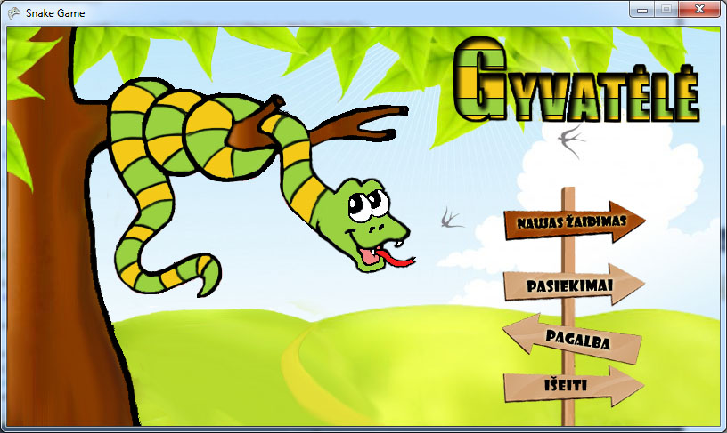
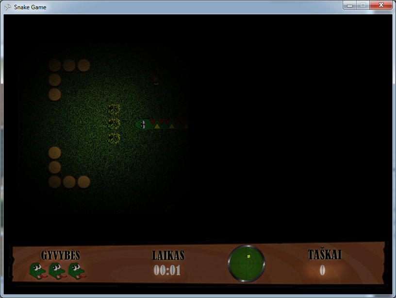
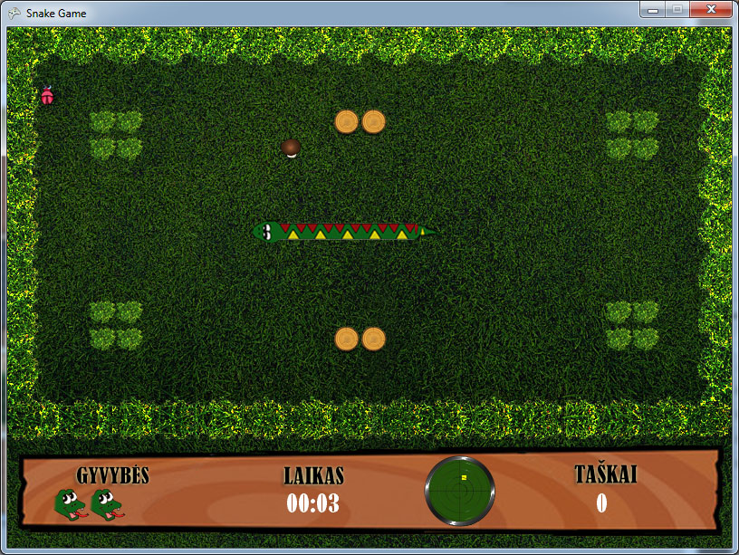

# Žaidimas "Gyvatėlė"

Žaidimo realizavimui pasirinkta XNA platforma. Šis žaidimas yra mano pirmasis realizuotas šia platforma. 

Trumpai apie žaidimą:
Patį žaidimą sudaro du rėžimai:
* Klasikinis,
* Nuotykių.
Šiuose žaidimo rėžimuose žaidėjui suteikiama po tris gyvybes.
Klasikiniame žaidimo rėžime žaidėjas renka gyvatės maistą už kurį skiriama taškų.
Nuotykių rėžimas sudarytas iš 6 lygių. Pirmajame lygyje žaidėjo tikslas išvengti kliūčių ir išsilaikyti žaidime kiek galima ilgiau su ilga gyvate. 
Antrajame lygyje veiksmas vykstą naktį, tad nematysite viso žaidimo lauko. 

Trečiajame lygyje be įprasto gyvatės maisto yra ir vabalas, kuris bandys nuo gyvatės pasprukti. 

Ketvirtasis lygis nustebins tuo, kad čia gyvatė kas 15 sekundžių pagreitės.  Paskutiniuose dvejuose lygiuose gyvatę valdysite tarp įvairių kliūčių.

